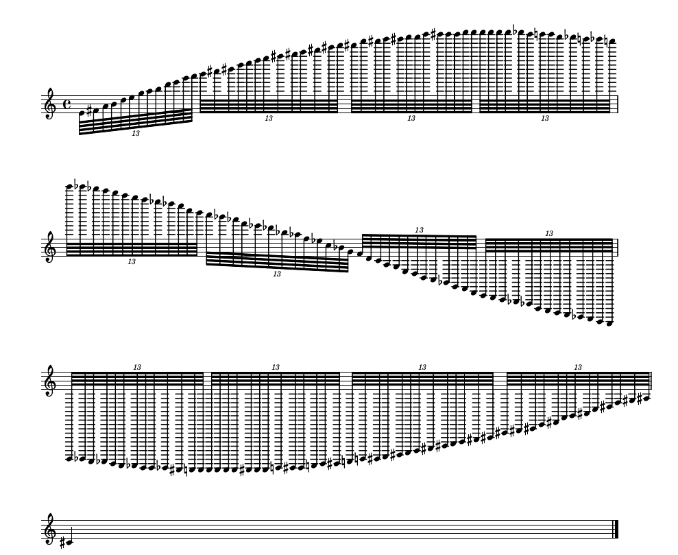

```python

# sineMelody.py
#
# This program demonstrates how to create a melody from a sine wave.
# It maps the sine function to a melodic (i.e., pitch) contour.
# Adopted from https://jythonmusic.me/ch-10-music-number-and-nature/


from math import (sin, pi)
from kodou import *


density = 25                 # higher for more notes in sine curve
cycle = int(2 * pi * density)  # steps to traverse a complete cycle


def linear_interpolation(b, a, c, x, z):
    """returns y"""
    return (z - x) / (c - a) * (b - a) + b


notes = []
# create one cycle of the sine curve at given density
for i in range(cycle):
   x = sin(i / density)    # calculate the next sine value
   notes.append(round(linear_interpolation(x, -1, 1, 0, 127)))


# now, all the notes have been created
kodou(Part({"notes": notes,
            "beats": [b * 1/13 for b in range(len(notes))]},
           {"barline": {12: "|."}}))

```


